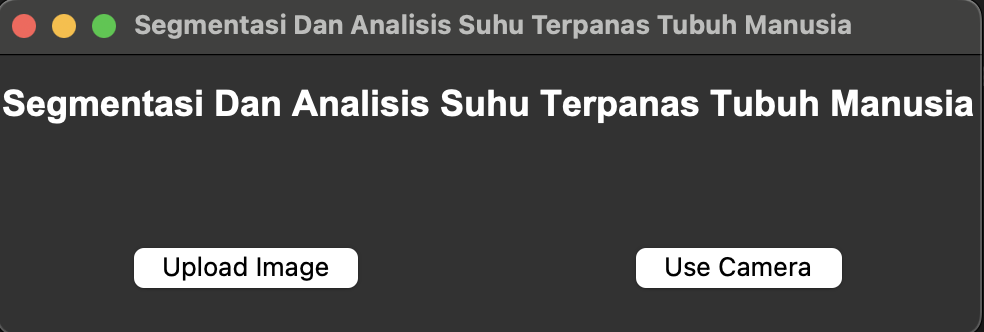

# Segmentasi Dan Analisis Suhu Terpanas Tubuh Manusia

This application performs segmentation and analysis of the hottest areas of the human body using a pre-trained UNet model. The application allows you to upload an image or use a live camera feed for real-time analysis.

## Features

- Load a pre-trained UNet model for image segmentation.
- Upload an image for analysis.
- Use a live camera feed for real-time analysis.
- Display original and processed images side by side.
- Display metrics such as IoU, accuracy, precision, recall, and Dice score.

## Requirements

- Python 3.7 or higher
- TensorFlow
- OpenCV
- Pillow
- Tkinter

## Installation

1. Clone the repository:

```sh
git clone https://github.com/tinapyp/body-thermal-segmentation-using-unet
cd body-thermal-segmentation-using-unet
```

if you want to pull the data as well you can use
```sh
git lfs pull
```

2. Install the required dependencies:

```sh
pip install -r requirements.txt
```

## Usage

1. Ensure you have the pre-trained model file `2.0-model.h5` in the `models` directory.

2. Run the application:

```sh
python app.py
```

3. The main window of the application will appear.

### Upload Image

1. Click the "Upload Image" button.
2. Select an image file from your local filesystem.
3. The application will display the original image and the processed image side by side, along with segmentation metrics.

### Use Camera

1. Click the "Use Camera" button.
2. The application will start capturing frames from your camera.
3. The original and processed frames will be displayed side by side in real-time.

### Metrics Displayed

- **IoU (Intersection over Union)**
- **Accuracy**
- **Precision**
- **Recall**
- **Dice Score**

## File Structure

- `app.py`: Main application script.
- `models/2.0-model.h5`: Pre-trained UNet model file.
- `requirements.txt`: Required Python packages.
- `README.md`: Documentation file.

## Screenshots

### Main Window



## Contributing
If you would like to contribute to this project, please create a fork of the repository and submit a pull request with your changes.

## Acknowledgements

- The UNet model used in this application is based on the paper ["U-Net: Convolutional Networks for Biomedical Image Segmentation"](https://arxiv.org/abs/1505.04597) by Olaf Ronneberger, Philipp Fischer, and Thomas Brox.
- The implementation of the Dice loss and Dice coefficient functions is based on various online resources and adapted for this project.